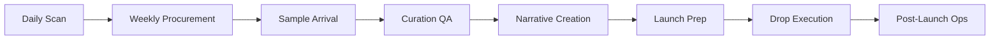

# Weekly Workflow Cadence

> End-to-end workflow for ZapNest Black Box operations.

---

## Overview



---

## Stage 1: Daily Discovery

**Agent**: TrendRadar  
**Schedule**: Daily at 02:00 IST  
**Trigger**: Cron job

### Tasks
1. Run trend scan across configured sources
2. Score candidates (signal_score)
3. Flag `recommended_action: shortlist` candidates
4. Output `candidates.json`

### Output
```json
{
  "run_date": "...",
  "candidates": [...],
  "shortlisted_count": 5
}
```

### Next Step
If `shortlisted_count > 0` → Create procurement tasks

---

## Stage 2: Weekly Procurement

**Agent**: Procurement  
**Schedule**: Weekly (Sundays 03:00 IST) or on-demand  
**Trigger**: Shortlisted candidates from TrendRadar

### Tasks
1. Evaluate suppliers for each shortlisted candidate
2. Score suppliers (score field)
3. Calculate landed cost (Mumbai)
4. Generate negotiation templates
5. Recommend sample orders

### HITL Checkpoint
**Supplier Shortlist Approval**
- Owner: Procurement Lead
- Blocking: Yes
- Approval required before sample orders

### Output
```json
{
  "candidate_id": "...",
  "supplier_list": [...],
  "recommended_supplier_id": "...",
  "human_action": "approve_sample_order"
}
```

### Next Step
On approval → Place sample orders

---

## Stage 3: Sample Arrival

**Trigger**: Sample received at warehouse  
**Timeline**: T + 14-28 days (depending on supplier lead time)

### Tasks
1. Log sample receipt
2. Conduct physical inspection
3. Run QA tests (battery, runtime, specs)
4. Document results in `sample_test` object

### Data Collected
```json
{
  "sample_test": {
    "battery_cycles": 500,
    "runtime_hours": 3.2,
    "weight_g": 420,
    "measured_specs": {...},
    "visual_inspection": "...",
    "audio_test_score": 7
  }
}
```

### Next Step
Trigger CurationAgent with test data

---

## Stage 4: Curation QA

**Agent**: Curation  
**Trigger**: Sample test data available

### Tasks
1. Score product (utility, durability, trust)
2. Verify specs against claims
3. Assign box slot recommendation
4. Flag compliance requirements
5. Decision: approve/reject

### HITL Checkpoint
**Product Approval**
- Owner: Product Lead
- Blocking: Yes (for compliance flags)
- Approval required before box inclusion

### Decision Matrix
| Trust Score | Decision |
|-------------|----------|
| ≥ 0.75 | Approve for Elite |
| ≥ 0.65 | Approve for Core |
| ≥ 0.55 | Approve for Lite |
| < 0.55 | Reject |

### Next Step
On approval → Add to box composition

---

## Stage 5: Box Composition & Narrative

**Timeline**: T-14 days before launch  
**Agents**: Curation (box), Narrative (copy)

### Tasks
1. Compose box contents (hero + accessories)
2. Calculate pricing and margins
3. Create drop copy:
   - Headline/subheadline
   - Hero description
   - 6 bullets, 3 FAQs
   - Social teasers
   - 3-email sequence
4. Audit all claims

### HITL Checkpoint
**Final Box Contents**
- Owner: Product Lead
- Blocking: Yes
- Approve packaging, pricing, margin

**Marketing Copy Approval**
- Owner: Marketing/Legal
- Blocking: Yes
- Review all public claims

### Output
```json
{
  "box_id": "box-core-2025-02",
  "drop_id": "drop-001",
  "products": [...],
  "narrative": {...}
}
```

---

## Stage 6: Launch Preparation

**Timeline**: T-14 to T-1  
**Agent**: Launch

### Tasks
1. Create launch timeline
2. Generate ad copy variations
3. Allocate budget across channels
4. Coordinate influencer wave
5. Set up referral program
6. Define KPI targets

### HITL Checkpoint
**Launch Budget Approval**
- Owner: CFO/Marketing
- Blocking: Yes
- Approve total spend and allocation

**Ad Creative Approval**
- Owner: Marketing Lead
- Blocking: Yes
- Review all ad variations

### Pre-Launch Checklist
- [ ] Ad accounts funded
- [ ] Tracking pixels installed
- [ ] Email sequences scheduled
- [ ] Influencer content received
- [ ] Inventory confirmed
- [ ] Fulfillment partner notified

---

## Stage 7: Drop Execution

**Timeline**: Launch Day (T+0)  
**Agents**: Launch, Personalization

### Tasks
1. Activate ads on all channels
2. Send launch email
3. Monitor real-time metrics
4. Apply personalization for variants
5. First 24-hour performance check

### Metrics to Monitor
- Ad CTR and spend
- Landing page conversion
- Email open/click rates
- Inventory levels

---

## Stage 8: Post-Launch Operations

**Timeline**: T+0 to T+30  
**Agents**: Support, Curation (monitoring)

### Week 1 (T+0 to T+7)
1. Support triage active
2. Daily performance reports
3. Ad optimization adjustments
4. Follow-up email (T+3)

### Week 2-4 (T+8 to T+30)
1. Monitor defect rate signals
2. Retargeting campaigns
3. Collect customer feedback
4. Final campaign report

### Defect Monitoring
```json
{
  "defect_threshold_pct": 4.0,
  "current_defect_rate": 2.1,
  "action_required": false
}
```

If `defect_rate > 4%`:
- Pause supplier orders
- Trigger supplier quality review
- Consider recall if > 10%

---

## Weekly Schedule Summary

| Day | Agent | Task |
|-----|-------|------|
| Daily | TrendRadar | Scan + score candidates |
| Sunday | Procurement | Process shortlist |
| On receipt | Curation | QA samples |
| T-14 | Narrative + Launch | Copy + campaign prep |
| T-0 | Launch | Execute drop |
| T+1 to T+30 | Support | Triage + monitor |

---

## Orchestration Command

When running the weekly cycle, the orchestrator should produce:

```json
{
  "week_of": "2025-02-03",
  "scheduled_runs": [
    {"agent": "TrendRadar", "schedule": "daily", "next": "2025-02-04T02:00:00+05:30"},
    {"agent": "Procurement", "schedule": "weekly", "next": "2025-02-09T03:00:00+05:30"},
    {"agent": "Curation", "schedule": "on_sample", "next": "pending"},
    {"agent": "Narrative", "schedule": "on_box_approval", "next": "pending"},
    {"agent": "Launch", "schedule": "on_approval", "next": "pending"},
    {"agent": "Support", "schedule": "continuous", "next": "active"}
  ],
  "hitl_pending": [
    {"checkpoint": "supplier_shortlist", "due": "2025-02-10"},
    {"checkpoint": "box_contents", "due": "2025-02-14"},
    {"checkpoint": "launch_budget", "due": "2025-02-20"}
  ]
}
```
